# Harmony Haven Hotels

Harmony Haven Hotels is a site that wishes to promote the use of the hotel’s programs. Harmony Haven Hotels is a hotel chain that has multiple hotels across six continents, and a major problem for young travellers when travelling the world is the constant change in quality and price in hotels. Therefore Harmony Haven Hotels have two major programs to choose from that allow users to pay a monthly fee to stay at any Harmony Haven Hotel across the world. Thus through the use of the site Harmony Haven Hotels can promote their programmes. The goal of the site is to promote and increase the number of members.

The site will be targeted to young travellers wishing to stay at safe and luxurious hotels at a constant price and quality. The user will be able to find out all the information they need about the programmes and how to become a member of Harmony Haven Hotels. This is done by the use of the three major interactive pages of Harmony Haven Hotels website. The site contains a ‘Home’ page, a ‘Destinations’ page and a ’Sign-up’ page accompanied by a landing page once the data for the sign-up page has been submitted. The home page contains information about Harmony Haven Hotels and its origins, the deals and offers the site provides and a section of comments reviewing the service from fellow young travellers. The site uses interactive and stylistic choices to encourage the user to achieve their own goals as well as the site's owner. Harmony Haven Hotels will be useful for travellers to see and join a service that can help them on their travels.

## Features

### Existing Features

#### General Features

__The Header__

* Featured on all three major pages of the site, it is fully responsive to all devices and includes a central navigation bar. It includes four links, Logo, Home page, Destinations page, and Sign up page. 
  - This keeps an organized, simple and consistent look for the website making it easy for the user to navigate through the page on all devices.

* The title/logo of the site is on the left and links to the home page. Through it links to the home page there is also another link to the right which is for the home page too. The other two are for the destinations page and the signup page
  - This continues to be consistent for the user and makes it easy and simple to use.

* When viewed on a laptop or desktop or any device that uses a mouse to navigate through the page when hovered on the link the color will change to brighter. When the linked page is being viewed, the link will appear underlined and coloured. The Sign Up linked text appears to be coloured on tablets and larger devices.
  - This allows the user to see the current page in use, whilst also showing the user that the other links are interactive, therefore encouraging the user to explore the site more.

* On tablets and larger devices, the header will appear with all four linked text on the header but on smaller devices, the header will be seen as the title/logo to the left and icon toggle which will appear as a dropdown button.
  - This continues to be organized but also adapting to the change in device size. Thus adapting to the user's needs.

* The one exception to the header is on the landing page once the data of the sign-up page has been submitted, contains one link to the home page with an arrow icon to the left and the text ‘Home’.
  - This allows the user to simply note that on this page there is nothing to interact with, therefore returning the user to the home page to learn more.

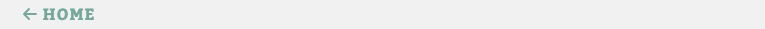

__The Footer__

* On all pages of the site, the footer is present keeping the same view for all pages. The footer contains two major aspects; contact information- with an email address and a phone number. As well as icons that link and open in a new tab to four different social networks such as Facebook, Twitter, Youtube, and Instagram.
  - This allows the user to explore and learn more about the server through social networks which is a comfortable portal for the chosen user audience, being young travelers as well as keeping a basic contact information section too.

* Like the links found in the header, links to the email address and phone number are constantly left highlighted. Also when the user uses a device that is directed by a mouse the text hovered over the text will grow lighter. On top of all this when the links for contact information are used the links then direct the user to the appropriate way to contact the company, for example, When the user clicks on the link to the email address this then opens the mail application and fills the ‘to’ input with the companies email address, and the same goes for the phone number it will automatically open the default application for calling.
  - This allows the user to have an interactive experience within the site and provides a clear indication that features can be interactive. The links also provide the user with a productive way of contacting the company.

* Each aspect is correctly labelled to continue to provide a clear outline of the footer, however, the label for the social networks disappears once the screen size drops past a standard tablet device and the aspects then are stated into a column rather than a row. While also creating horizontal lines to divide the text more.
  - This aspect adapts to the user's needs to any device they use, as well as provides the user with a simplistic way of contacting and interacting with the company. As well as dividing the information separately.

__The Cover Images/messages and Nav Bars__

* The two main information pages (home page and destinations page), start with a cover image with a cover text message and directly below it is a navigation bar that directs links to sections found on that specific page.
  - This keeps a consistent and welcoming look to the initial view of the page.

* On both pages there is an image that is tailored to that specific page, for example on the destinations page the image is a bird eye view of someone working out a plan with a map. On top of that cover image is a message that adapts to the size of the image below it. It has a semi-transparent background colour, the text itself is cursive and contains a motivational quote such as “Choose Your Own Path!”. These features are most responsive to any size and move simultaneously.
  - This provides the user with a welcoming and motivational reaction when they first arrive on the page, therefore prompting them to become a member. Whilst also keeping a consistent look and feel for every page. This also provides the user with access to the site on any device. It covers the entire width of the page sets somewhat of a divide and blocks off and spaces out features of the page, therefore providing a simplistic look to the site.

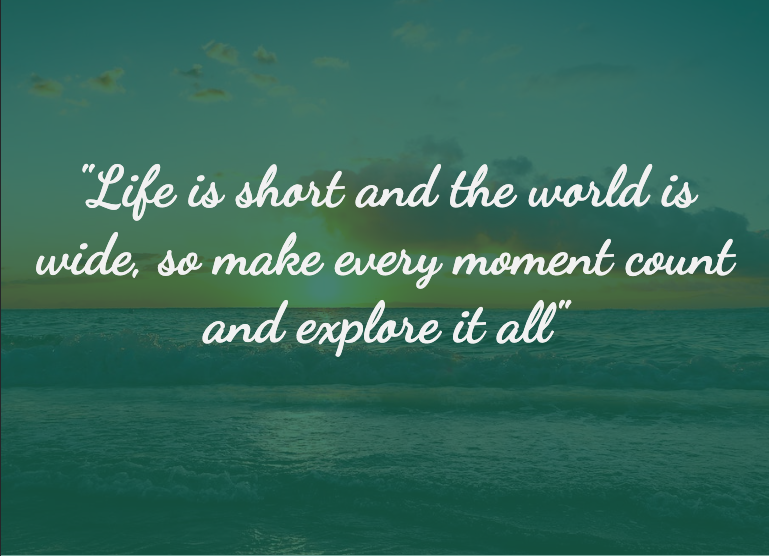

* Below both welcome images is a responsive navigation bar that directs the user to certain aspects of the page. Each is linked and when interacted with the page will smoothly scroll down to the linked section. These elements are specific for each of the pages and have the same hover feature as other linked text.
  - This continues to provide the user with an interactive and organized way of navigating through the page and also keeps a constant flow.

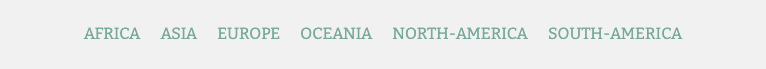

__The Style__

* The style of the site is kept consistent and clear. Throughout the site, it keeps the same fonts, colours, shapes, and layout.
  - The fonts of the site are all imported from Google Fonts and are kept to a minimum of three fonts. ‘Kadwa’ is for the major headings, ‘Bitter’ is for the body text and ‘Dancing-script’ is used for motivational quotes of the cover images for example. This allows the viewer to correctly identify the structure of the site. As well as keep a variation in the display.  
  - The colours of the site are kept to a minimum of three the major colours are #f1f1f1 (an off-white colour), #3a3a3a (an off-black colour), and #81a59b (a neutral duck-egg blue). The feature colour is duck-egg blue, it is the primary colour of the site and acts as a feature colour. Any other colour is a variety of duck-egg colours. This keeps a simplistic colour scheme that resembles calm natural tones that match the feeling of calm and peaceful holidays. Therefore this helps the user to experience a calming site with neutral colors, therefore prompting the user to become a member of a calm and peaceful holiday service.
  - As a whole the site integrates square and circular aspects to feature. However, the site creates a modern and structured shape. For example, the images on a page are circular since this helps to break up the space around the image but makes it more inviting to look at for the user. Using circular elements within the site continues to provide the user with a calming effect.
  - The layout of the Home page and Destinations Page are relatively the same, but altered in various sections will colour, This keeps the style and colour consistent while also exploring the possibility of different tones and variations to the page to make them stand out more. This allows the user to experience a site that is consistent while also not being too consistent by making the pages identical to one another.  

#### Home Page Features

__The About Us Section__
The About Us section is the opening feature of the home page. It features a heading, two paragraphs and a circular image of the couple to the right. When viewed on a tablet or larger devices the image will always take up 50% of the screen and the text wraps around the image. However, the font size and image size depend on the screen size. Another aspect within the paragraph is two anchor elements that link to other sections within the page. The About Us section was of utmost importance to the home page.

The About Us section allows the user to investigate and understand more about the goal of the company as well as the site’s purpose so that they can understand if this site will help them achieve their goal. The circular image creates a neutral and calming site environment. The image allows the user to have a visual representation of the owners of the site, which makes the exchange of information between the site owner and external user to be more of a conversation. Thus the image is as important as the text, so in concern of responsive design, the image always takes up the same space as the text. When the screen size of the devices goes below the size of a standard tablet the text becomes above the image in the column rather than a row, this is to ensure the user has a clear understanding and flow through the page. The anchor elements also provide the user with a direct and efficient way through the page, thus the colour draws the attention to the user that these pieces of text can be interacted with. To conclude the ‘About Us’ section is of importance to the whole site for it provides an overview of the purpose of the company and the site.  

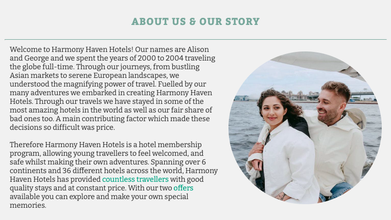

__Deals and Offers Section__
In concern to the ‘Deals and Offers’ section, is to be considered as one of the most important aspects of the whole site. It contains a heading and two boxes containing the offers themselves.

It was important to provide the user with a clear understanding of the deals available, therefore the use of a bold heading and clear bullet points were essential. The user needs to be informed about what is available, where they can go, and how they can become a member. All of these questions were provided.

The ‘Or’ text between the two options was applied to ensure the user has an understanding of the two separate programs, and to continue this separation are the borders found around the options.

As well as this the colour of the boxes was changed since this is one of the most essential parts of the site it needed to stand out from other sections found on the site. Therefore the deals and offers section uses colour and background colour to create a difference between the sections, this allows the user to rightly identify certain sections of the page.

At the bottom of the boxes of the deals is an anchor element that leads the user to the signup page. The colour is brighter than the normal text to inform the user that this aspect of the page can be interacted with. This continues to promote the user to become a member which therefore achieves the site owner's goal.

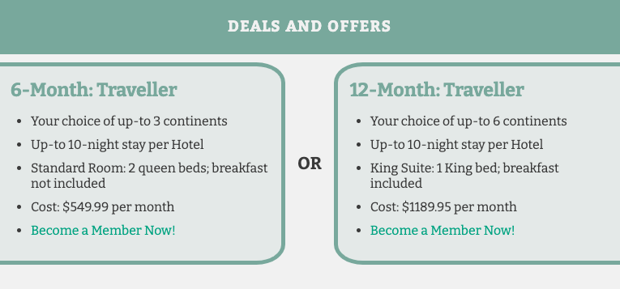

__Image Section__
This is the image section within the home page. It is used to create a visual representation of what the user could be booking if they become a member. This feature not only acts as visual motivation but provides a block divide between the ‘Deals and Offers’ and ‘Reviews’ which also allows the user to understand the content of the page once the text has been spaced out from one another. There may be future features to implement here.

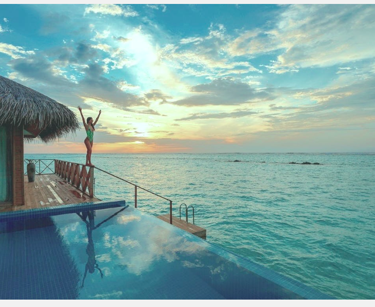

__Review Section__
The review section was another feature to be included as it was important to the site’s owner's goal to receive more memberships. Providing reviews from former travellers who have used this hotel service. This gives the user assurance of the hotel service thus encouraging them to sign up for membership.

Since the comments from former travellers are rather short it was important to be efficient with the space they take up on the page on a mobile device they appear stacked on top of one another, in a column. In concern to responsive design once the user's screen grows from mobile the reviews are evenly spread across the screen. So once the screen reaches the laptop or desktop all the reviews appear in a row. This was to make sure that reviews stand as a collective rather than individual reviews. Since this is important to the user, on their initial view of the page, the reviews can be together.

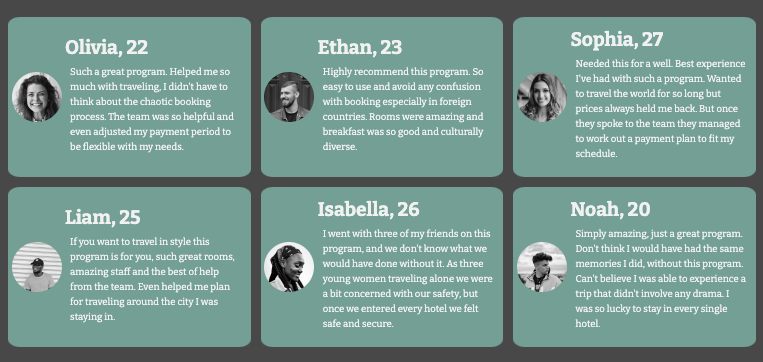

Yet again colors have been reimagined in a different style giving this section its individuality whilst also staying consistent with the style of the site. This consistent environment provides the user with a great deal of comfort and flow of the page.

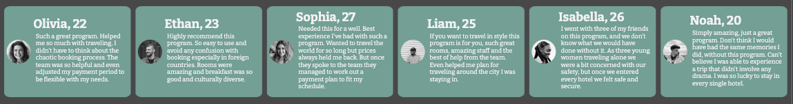

In each of the reviews is a heading containing the former traveller's name and age, a circular image of the former traveller and a personal comment provided by the former traveller. This provides the user with information about the service from different sources, which provides reliability thus prompting the user to sign up.  The name,  age and image continue to provide the user with a conversational interaction and provide potential users with references that help them reach a decision based on similarities between themselves and the former travellers found on the page.

#### Destination Page Features

__Continents Section__
Within the destinations, there are six continent sections, containing three possible destinations in that continent. Within these destinations is a circular image of the destination and a box description of the destination.  

It was essential to separate the continents with headings, to contain its content. To add to this a small borderline for each destination was created.
The destination page continues to stick to a similar style. Each description of every destination is clear and concise to the user. This was done with an underlined heading of the destination and bullet points with the features of the possible hotel.

In concern to responsive design when viewed on a mobile device the text box is stated above the image to continue the trend of an organised page. However, when viewed on tablets and larger devices the image and text box appear in a row and the order of image and text alternate, this creates an organised flow to the page when seen on larger devices and keeps the site interesting to the user.

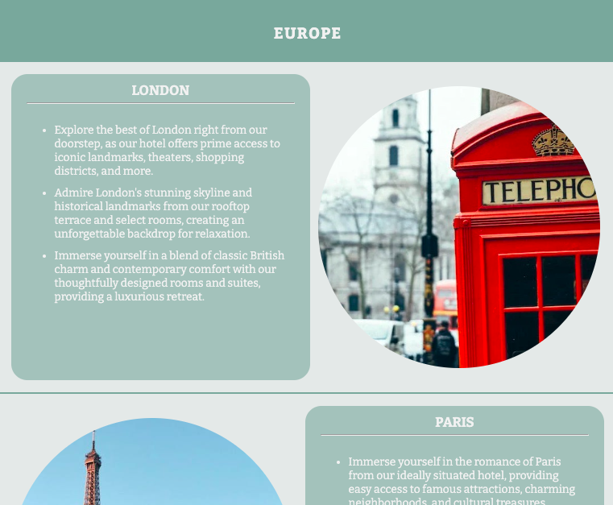

#### Sign-Up and Landing Page Features

__Sign Up form__
The signup form is one of the most important features of the whole site since it is the main aspect that achieves the site owner's goal of creating more memberships. Therefore the signup form was created to be as welcoming as possible. The whole page is covered with an image of a cliff side with a path down which reflects the quote on the top of the form. The tones in the images also match those of the chosen colours for the whole site.  The heading on the page matches the cover image of the other pages, this continues to be consistent and creates a calming and motivational environment.

The form stays in the center of the page still this draws the user to the form rather than the image. The form keeps a clear and organised flow to ensure the user submits all the required data. All inputs are mandatory and necessary for the company to understand the request.

Once all data has been filled in it is ready to be submitted. Using the ‘Let’s Go!’ button, (which will be adjusted for future feature implementation) the button will link to a landing page. Once on this page it strongly resembles the signup page, this was designed to be consistent with the signup page. This is to show the user that these two pages are connected. The only difference between the two is the cover text, which is larger and which clearly provides the user with confirmation that the data has been submitted.

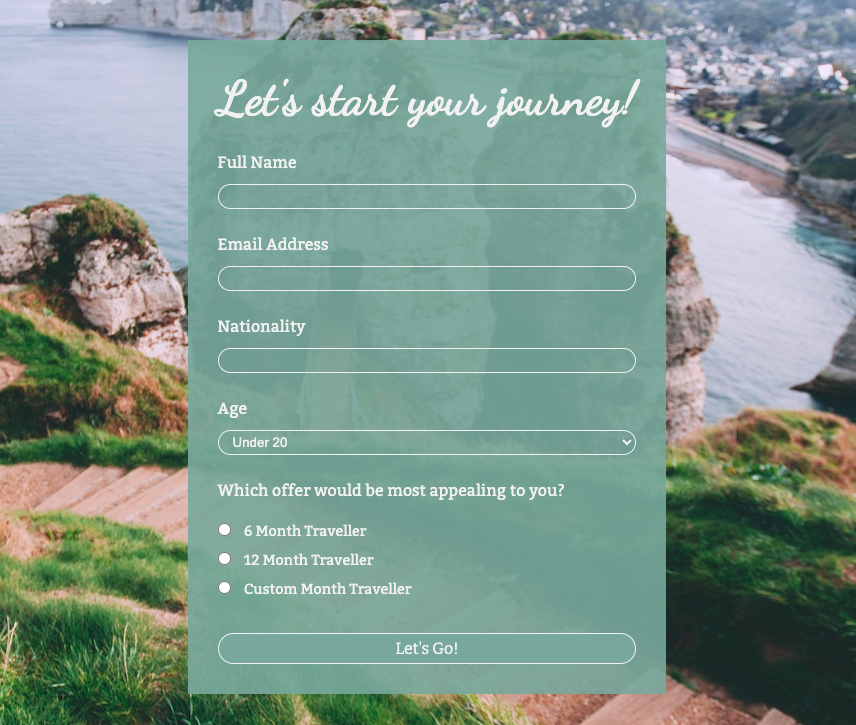

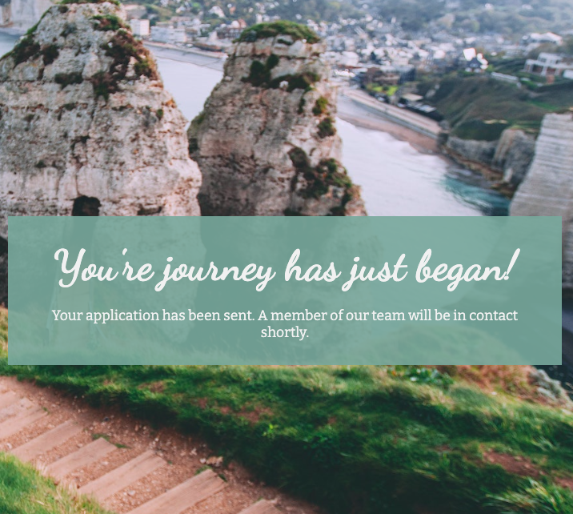

### Features Left to Implement

__Slideshow features__

__A booking system__

__Submit Button__

## Languages and Resources

* [HTML5](https://html.spec.whatwg.org/multipage/)  -Markup language which makes up the content of the site.
* [CSS3](https://www.w3.org/TR/css-2022/)   -Used to style the whole site.
* [FontAwesome](https://fontawesome.com/)   -Linked for all icons used on the site
* [Google Fonts](https://fonts.google.com/) -Source of the site’s fonts.
* [GitHub](https://github.com/) -Repository for the site’s code.
* [Codeanywhere](https://www.codecademy.com/)   -IDE used to write the site.
* [HTML Validator](https://validator.w3.org/)   -Used to check and validate the HTML code used in the site.
* [CSS Validator](https://jigsaw.w3.org/css-validator/) -Used to check and validate the CSS code used in the site.

## Testing

* I have tested the site on multiple browsers, such as; Chrome, Safari and Firebox.
* The site and all of its pages are responsive to all devices and have a clear and organized format. I have tested this by using dev tools on Chrome as well as sharing the link to the site on my other devices. The site also has been tested and its structure also adapts to the screen size.
* All the information on the site is clear and visible as well and the contrast of colour is well set and it is readable and easy to understand. I have also shared the site with other people to have an understanding of other views on the site and all came to the same result that the site is easy to read and understand.
* I have made sure that all links to other sections of the page work, as well as I tested links that open tabs and/or open contact applications all work perfectly. As well as this I have tested the hover function on all linked items on the site and they all work.
* Finally, I have made sure that the form inputs are required and only the appropriate value for the form to be submitted. I have done this by removing the temporary ‘Let’s go’ button with a submit input, and it confirms that the other inputs work perfectly.

### Validator Testing

CSS on the whole site:

* There were errors, however, they have since been checked and adjusted. However, now there are no errors on any of the pages of the site when passing through the official [(Jigsaw) validator](https://jigsaw.w3.org/css-validator/validator?uri=https%3A%2F%2Fgabrielh-02.github.io%2FHarmony-Haven-Hotels%2Findex.html&profile=css3svg&usermedium=all&warning=1&vextwarning=&lang=en)

HTML on the whole site: 

* Home page: There were errors, however, they have since been checked and adjusted. However, now there are no errors on any of the pages of the site when passing through the official [W3C validator](https://validator.w3.org/nu/?doc=https%3A%2F%2Fgabrielh-02.github.io%2FHarmony-Haven-Hotels%2Findex.html)

* Destinations page: There were errors, however, they have since been checked and adjusted. However, now there are no errors on any of the pages of the site when passing through the official [W3C validator](https://validator.w3.org/nu/?doc=https%3A%2F%2Fgabrielh-02.github.io%2FHarmony-Haven-Hotels%2Fdestinations.html)
  

* Sign Up page: There were errors, however, they have since been checked and adjusted. However, now there are no errors on any of the pages of the site when passing through the official [W3C validator](https://validator.w3.org/nu/?doc=https%3A%2F%2Fgabrielh-02.github.io%2FHarmony-Haven-Hotels%2Fsignup.html)

* Landing page: There were errors, however, they have since been checked and adjusted. However, now there are no errors on any of the pages of the site when passing through the official [W3C validator](https://validator.w3.org/nu/?doc=https%3A%2F%2Fgabrielh-02.github.io%2FHarmony-Haven-Hotels%2Flanding.html)
  

Accessibility on the whole site

* Home page: The page has been through the develoer tool Lighthouse on chrome, the accessibility score comes to 95%. 

  
* Destinations page: The page has been through the develoer tool Lighthouse on chrome, the accessibility score comes to 95%.

  
* Sign Up page: The page has been through the develoer tool Lighthouse on chrome, the accessibility score comes to 96%.

  
* Landing page: The page has been through the develoer tool Lighthouse on chrome, the accessibility score comes to 95%.

### Bugs

#### Fixed Bugs
* Whilst in the process of testing I found some bugs/ errors in code on the site;
* The Deals and Offers link on the specific navigation bar on the homepage was not linking to the section on the page therefore it needed to be adjusted with the proper id value.
* Another error that appeared was the fact that in my final unvalidated version of the site, I used aria-labeled values on the divs with the links to images on the style sheet however this was incorrect therefore I removed these labels
* Whilst testing, errors came up in concern to section values with no heading values, thus adding these headings, however, added a hidden class in the stylesheet so that these headings would be hidden and wouldn't affect the final version.

#### Unfixed Bugs
* There are no unfixed bugs, the only concern is that on the sign-up page, the “Submit” button is a linked text item that appears to be a button that only directs the user to a landing page.

## Deployment
The site was deployed to GitHub pages. The steps to deploy are as follows:
* In the GitHub repository, navigate to the Settings tab
* From the source section drop-down menu, select the Main Branch, then click “Save”.
* The page will be automatically refreshed with a detailed ribbon display to indicate the successful deployment.

The live link can be found [here](https://gabrielh-02.github.io/Harmony-Haven-Hotels/)

## Credits

### Content
* The code template for the site was provided by [Code Institute](https://github.com/Code-Institute-Org/ci-full-template)
* The code for anchor elements and the HTML file to scroll smoothly, as well as creating a link to open default contract applications was taken from the information provided by [Web Dev Tutorials](https://www.youtube.com/watch?v=k4EGA95ZK4o)
* The code to create a circular image was inspired by the code of [Love Running Project](https://gabrielh-02.github.io/love-running/)
* The code to make the nav toggle for the header in concern to responsive design was inspired by the code found on the [Love Running Project](https://gabrielh-02.github.io/love-running/)
* All information about individual countries on the destination page was generated using ChatGBT.
* All fonts for the page were sampled from the [Google Fonts](https://fonts.google.com/)
* All icons found on the page were taken from [Font Awesome](https://fontawesome.com/)

### Media
* All photos that are used in the site were taken from [pexels](https://www.pexels.com/)
* The favicon was generated by me through the use of Adobe Illustrator.
